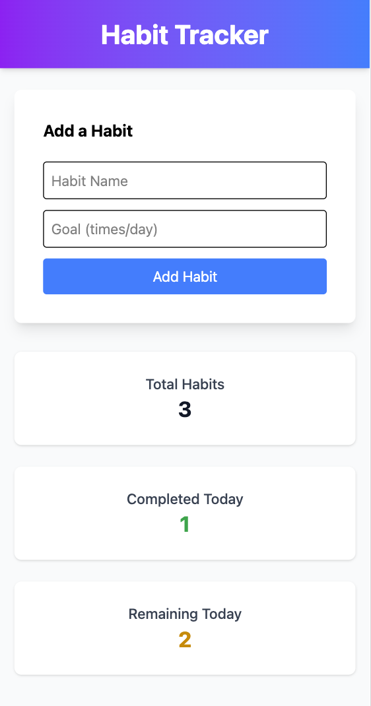
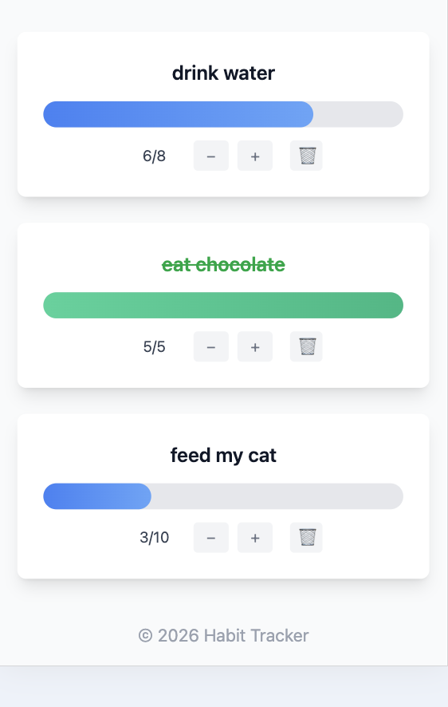

# Habit Tracker App

## Live Demo

Check out the live app here: [Open Demo](https://habit-tracker-justber.vercel.app/)

👩‍💻 Author

Created by Justyna Bereza

🔗 [LinkedIn Profile](https://www.linkedin.com/in/your-profile)

## 📌 Project Description

This is a simple Habit Tracker web application built with React.  
The application allows users to create habits, track daily progress, and monitor overall completion.

The goal of this project was to practice React fundamentals such as components, state management, props, and working with local storage.

## 🚀 Features

- Add new habits with a daily goal
- Increase or decrease progress for each habit
- Prevent negative progress values
- Automatically mark habits as completed when the goal is reached
- Delete habits
- View overall progress (completed vs total habits)
- Data persistence using localStorage
- Responsive design for desktop and mobile

## 🛠️ Technologies Used

- React (functional components & hooks)
- JavaScript (ES6)
- Tailwind CSS
- Vite
- Local Storage API

## 📂 Project Structure

src/
components/
Header.jsx
HabitForm.jsx
HabitList.jsx
HabitListItem.jsx
ProgressActions.jsx
App.jsx
main.jsx

💡 How It Works
• The application stores all habits in React state
• Each habit contains:
• name
• goal
• progress
• Users can update progress using buttons
• When progress reaches the goal, the habit is marked as completed
• Data is saved in the browser using localStorage so it persists after refresh

🧠 Learning Objectives

This project was created to practice:
• React components and modular structure
• useState and useEffect hooks
• Passing data using props
• Handling user events (forms, buttons)
• Conditional rendering
• Working with localStorage
• Basic UI/UX design

📈 Future Improvements
• Add editing habits
• Add categories or tags
• Add weekly or monthly tracking
• Add user authentication
• Improve UI design

📄 License

This project is licensed under the MIT License.

## 📸 Preview

